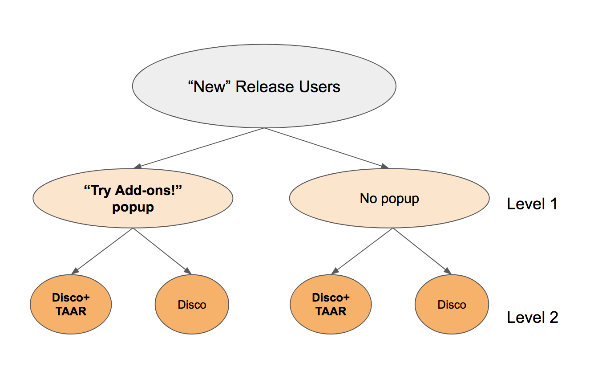

## Embedded WebExtension to be deployed as a [Shield Study](https://wiki.mozilla.org/Firefox/Shield/Shield_Studies).

Tests the new [Telemetry-Aware Add-on Recommender](https://github.com/mozilla/taar) (TAAR).

Users in the experiment will be placed in the following cohorts with equal probability at each level:

